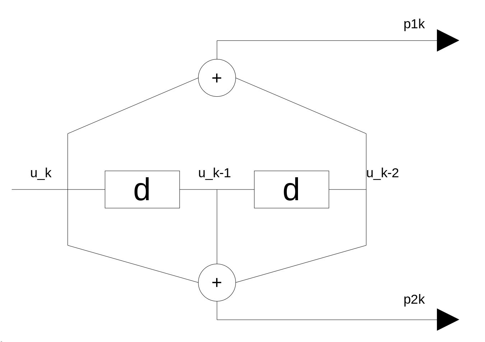
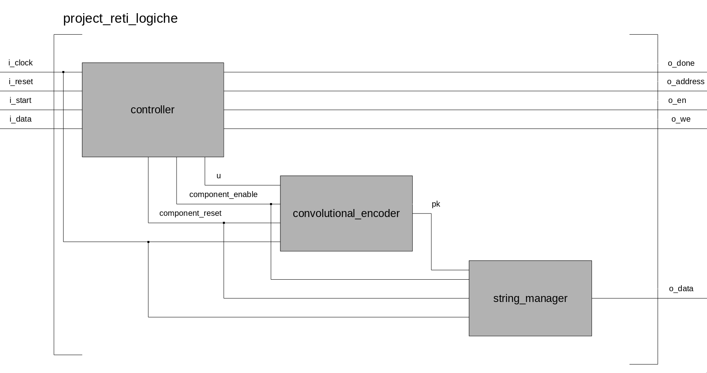
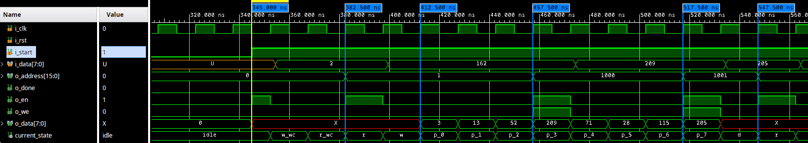
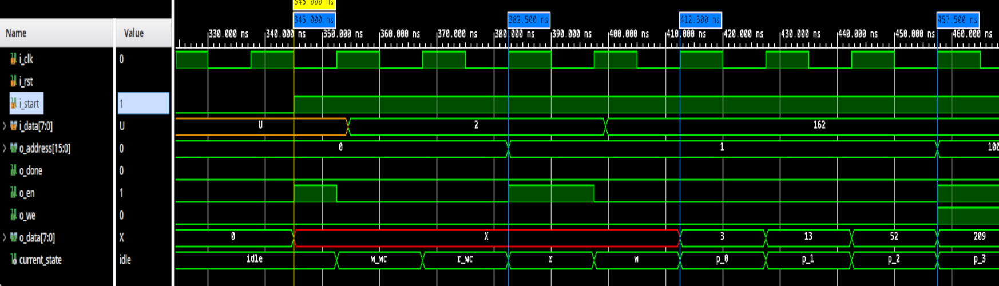
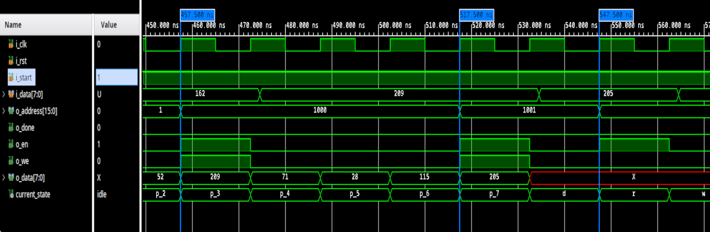

---
author:
- Davide Grazzani - *10660259*
date: A.A. 2021-2022
title: Progetto Reti Logiche
---
# Progetto Reti Logiche A.A. 2021-2022
Voto : 30L

Attenzione: conversione da `.tex` a `.md` utilizzando `pandoc`. Si trova il contenuto originale (meglio formattato) nella cartella `report/`.

# Codifiche Convoluzionali e Introduzione al Progetto

Una codifica convoluzionale è un tipo di codifica utilizzata per la
*Forward Error Correction* (FEC) in sistemi di telecomunicazioni basati
su canali monodirezionali.\
Attraverso una codifica convouzionale si genera un codice
convoluzionale, il quale trasforma ogni parola $P_1$ in una parola
$P_2$. Definite $l_1 = lenght(P_1)$ e $l_2 = lenght(P_2)$ si definisce
il rapporto $l_1/l_2$ come *tasso di trasmissione del convolutore*
(rate); con $l_2 \geq l_1$. Inoltre, la trasformazione è una funzione
degli ultimi $k$ bit in entrata, $k$ è quindi la *lunghezza dei vincoli*
del codice.\
Lo scopo del progetto è quello di implementare un componente hardware,
tramite l'utilizzo del linguaggio di specifica dello hardware VHDL, in
grado di interfacciarsi con una memoria ram e di applicare una codifica
convoluzionale con $rate = \frac{1}{2}$ e $k = 3$.

<figure id="codificatore_convoluzionale_image">

<figcaption>Codificatore convoluzionale con <span class="math inline">$r
= \frac{1}{2}$</span> e <span
class="math inline"><em>k</em> = 3</span></figcaption>
</figure>

## Specifiche del progetto

Vengono fornite l'interfaccia del progetto, la specifica della memoria
sulla quale interfacciarsi ed, infine, una limitazione temporale che
impone che il modulo hardware computi correttamente con periodi di clock
di almeno $clockPeriod_{req} = 100ns$.\
Di seguito viene riportata l'interfaccia del modulo e l'interfaccia
della memoria.

### Interfaccia del progetto

``` vhdl
entity project_reti_logiche is
    port (
        i_clk : in std_logic;
        i_rst : in std_logic;
        i_start : in std_logic;
        i_data : in std_logic_vector(7 downto 0);
        o_address : out std_logic_vector(15 downto 0);
        o_done : out std_logic;
        o_en : out std_logic;
        o_we : out std_logic;
        o_data : out std_logic_vector (7 downto 0)
    );
end project_reti_logiche;
```

### Interfaccia della memoria

``` vhdl
entity rams_sp_wf is
    port(
        clk : in std_logic;
        we : in std_logic;
        en : in std_logic;
        addr : in std_logic_vector(15 downto 0);
        di : in std_logic_vector(7 downto 0);
        do : out std_logic_vector(7 downto 0)
    );
end rams_sp_wf;
```

Per maggiori dettagli viene fornito il link alla *User Guide* di
*Vivado* dalla quale la memoria è stata derivata :
<https://www.xilinx.com/support/documentation/sw_manuals/xilinx2017_3/ug901-vivado-synthesis.pdf>

# Architettura, approccio e scelte implementative

In questa sezione verrà descritta la *FSM*[^1] del progetto seguita da
un rapido overview sul codice presentato. Prima però vengono riportate
alcune doverose considerazioni riguardanti il linguaggio di
programmazione VHDL.

## Considerazioni su VHDL

In questo progetto, durante la fase di progettazione e successivamente
di sviluppo, non verrà preso mai in considerazione l'utilizzo del
costrutto *process* e di conseguenza di architetture di tipo
*behavioral* . Questa scelta implementativa, che si riflette sia in fase
di sintesi che di implementazione, [non è dovuta]{.underline} al fatto
che l'autore del progetto creda che l'utilizzo di *process* sia
scorretto in qual si voglia forma o maniera. Si devono riconoscere le
potenzialità e le funzionalità implementative/strutturali che ne
derivano dall'utilizzo di quest'ultimi ma si deve anche considerare il
maggior strato di astrazione portato da questo costrutto rispetto ad
architetture *dataflow* o *structural*.\
È per il motivo sopra citato e per la non diretta corrispondenza tra
codice scritto e struttura interna del sintetizzato hardware che in
questo progetto sono state scartate implementazioni di tipo
*behavioral*.

## Primo design della FSM

Tenendo conto delle considerazioni sopra fatte viene ora presentato un
primo design della macchina a stati in grado già di soddisfare
ampiamente requisiti di timing sia post sintesi sia post
implementazione; viene discussa quest'ultima in quanto alla base del
design finale e da considerarsi design ottimale per periodi di clock
$clockPeriod \approx [35,100] ns$.

### Stati della macchina

<figure id="prima_fsm">

<figcaption>Primo design della <em>FSM</em></figcaption>
</figure>

con $wc$ definito come numero di parole ancora da codificare.

::: description
stato della macchina iniziale dove questa attende che il segnale
`i_start` venga portato alto; una volta che ciò accade in questo stato
vengono anche settati `o_en = ’1’` e `o_address = 0` in modo tale da
rendere il modulo pronto a ricevere il numero di parole dalla ram.
Questo coincide anche con lo stato di reset della FSM.

stato della macchina dove viene settato il numero di parole da
codificare.

stato della macchina adibito alla lettura della prossima parola da
codificare. In particolare in questo stato vengono settati i valori
valori di `o_en = ’1’` e `o_address = 1` in modo tale da leggere la
parola da codificare in questo ciclo della FSM

serie di 8 stati della macchina utilizzati per l'effettiva codifica
della parola. Questi servono in particolare a ciclare sul singolo bit
della parola considerata, oltre a contribuire alla sincronizzazione di
alcuni segnali necessari al funzionamento del componente(descritto in
maniera dettagliata più avanti). Espandiamo specificatamente:

-   $p_0$ : in questo stato viene anche letta la parola richiesta
    precedentemente nello stato $r$.

-   $p_3$, $p_4$ : in questi stati vengono settati `o_en = ’1’` e
    `o_we = ’1’` in modo tale da poter parallelizzare la scrittura della
    parola in memoria con la sua effettiva computazione.

stato della macchina che si dedica al controllo del numero di parole
rimaste da codificare. Se il numero di parole è $\neq 0$ allora la FSM
ritornerà alla stato $r$, altrimenti rimarrà in questo stato fintanto
che `i_start = ’1’` e parallelamente `o_done` verrà alzato.
:::

## Design finale della FSM

Come precedentemente scritto, la macchina sopra specificata superava i
test bench per periodi di clock $clockPeriod \approx [15,100] ns$ nelle
simulazione behavioral e post-sintesi, ma falliva post-implementazione
per $clockPeriod <\approx 35 ns$ dove le latenze dell'FPGA erano
maggiori.\
Una possibile soluzione sarebbe quella di aggiungere altri 2 stati così
da poter mitigare i ritardi dovuti alla lettura della memoria. Vengono
quindi qui sotto riportate delle semplici, seppur doverose, analisi in
termini di tempo e di spazio per poter giustificare il cambiamento delle
stuttura della macchina a stati.

### Analisi di trade-off spaziale

Considerando il numero di stati $numStati = 12$ e utilizzando la
codifica binaria $log_2(numStati) \approx 3.6$ quindi, si utilizzano 4
bit per la rappresentazione di tali stati. È facile verificare che
l'aggiunta di 2 stati, quindi $numStati = 14$, non richiede allocamento
aggiuntivo di memoria su FPGA.

### Analisi di trade-off temporale {#cap:tradeoff_temporale}

Essendo uno di questi 2 stati aggiuntivi eseguito solo una volta in fase
di lettura del numero di parole contenuto in ram, esso verrà trascurato
perchè asintoticamente irrilevante. Tenendo in considerazione gli stati
che vengono eseguiti in *loop*, facendo riferimento alla figura
[2](#prima_fsm){reference-type="ref" reference="prima_fsm"} gli stati da
$r$ a $d$, si ottiene $numStati_{m1} = 10$ e
$numStati_{m2} =numStati_{m1} + 1= 11$.\
Quindi perchè questa modifica alla FSM sia motivata si deve avere che
$$
                    numStati_{m1} * clockPeriod_{\textit{\text{m1 min}}} > numStati_{m2} * clockPeriod_{m2}
                
$$ con $clockPeriod_{m1 \space min} = 35 ns$.\
Si ottiene che $clockPeriod_{m2} \leq 31.82 ns$, condizione che verrà
poi verificata e discussa nella sezione riguardante i risultati
sperimentali.

### Nuova macchina a Stati

Vengono così aggiunti altri 2 stati :

Wait word count - $w_{wc}$

:   

Wait - $w$

:   

entrambi adibiti alla mitigazione del ritardo dovuto alla lettura della
memoria e alla propagazione di tale segnale in fase di implementazione.

<figure id="seconda_fsm">

<figcaption>Design finale compatto della <em>FSM</em>
finale</figcaption>
</figure>

\
**Nota :** In figuara [3](#seconda_fsm){reference-type="ref"
reference="seconda_fsm"} gli stati $p_0,p_1,...,p_7$ sono compressi in
un unico stato $p$ al solo fine di alleggerire la notazione della
macchina. Essi rimangono quindi separati come mostrato in figura
[2](#prima_fsm){reference-type="ref" reference="prima_fsm"}.

## Code overview

L'obbitettivo di questa sezione è quello di mettere in relazione le
scelte implementative precedentemente introdotte con l'effettivo codice
VHDL del progetto.\
Il progetto è composto da 3 principali componenti :

-   `controller`

-   `convolutional_encoder`

-   `string_manager`

Successivamente vengono riportate le interfacce delle entità e una breve
spiegazione sulle funzionalità implementate.

### `controller`

È il responsabile per il \"comportamento\" del componente. Controlla il
corretto cycling degli stati ed in modo diretto i segnali di `o_en`,
`o_we`, `o_address` e `o_done`.

``` vhdl
entity controller is
    port(
        clock            : in std_logic; --> i_clock
        reset            : in std_logic; --> i_reset
        start            : in std_logic; --> i_start
        data             : in std_logic_vector (7 downto 0); --> i_data
        done             : out std_logic := '-'; --> o_done
        mem_address      : out std_logic_vector(15 downto 0); --> o_address
        mem_enable       : out std_logic; --> o_en
        mem_write        : out std_logic; --> o_we
        u                : out std_logic; --> bit to be encoded
        component_enable : out std_logic := '0'; --> enable signal for other components
        component_reset  : out std_logic := '0' --> reset signal for other components
    );
end controller;
```

### `convolutional_encoder`

Parte del componente adibita alla codifica di un singolo bit di una
parola; implementa il codificatore convoluzionale mostrato in figura
[1](#codificatore_convoluzionale_image){reference-type="ref"
reference="codificatore_convoluzionale_image"}.

``` vhdl
entity convolutional_encoder is 
    port(
        u      : in std_logic; --> u
        clock  : in std_logic; --> i_clock
        reset  : in std_logic; --> component_reset
        enable : in std_logic; --> component_enable
        pk     : out std_logic_vector(1 downto 0) --> encoder's output
    );
end convolutional_encoder;
```

### `string_manager`

Questo modulo del componente ha il compito di concatenare i 2 bit di
output del `convolutional_encoder` per formare una parola in uscita, da
scrivere successivamente in memoria.

``` vhdl
entity string_manager is
    port(
    clock  : in std_logic; --> i_clock
    reset  : in std_logic; --> component_reset
    enable : in std_logic; --> component_enable
    bits   : in std_logic_vector(1 downto 0); --> pk
    half_z : out std_logic_vector(7 downto 0) --> o_data
    );
end string_manager;
```

### Schematico del codice

Viene qui riportata un'immagine che mostra i collegamenti fra le varie
entità del codice VHDL. La descrizione di tali collegamenti si può
ritrovare nell'architettura, di tipo *structural*, dell'entità
`project_reti_logiche`.

<figure id="collegamento_entità">

<figcaption>Schematico dei collegamenti tra le varie entità</figcaption>
</figure>

# Risultati sperimentali

In questa sezione verranno discussi tutti i risultati ottenuti
attraverso le varie tipologie e i tipi di test utilizzati per assicurare
il corretto funzionamento del componente; successivamente vengono
riportati alcuni dati sperimentali direttamente ottenuti dal tool di
sintesi ed implementazione *Vivado*. Vengono però prima riportate le
dimensioni, in termini di *LUT* e *FF*, del componente hardware
implementato.

LUT : 

:   87

FF : 

:   47

**Nota :** tutti i test eseguiti sono stati eseguiti su FPGA *Artix-7
xc7a200tfbg484-1*.

## Simulazioni

Come precedentemente accennato le simulazioni *behavioral* e di
*Post-Synthesis* (sia *Functional* che *Timing*) ottenevano esiti
positivi già utilizzando la FSM in figura
[2](#prima_fsm){reference-type="ref" reference="prima_fsm"} con un range
di clock $clockPeriod \approx [15,100] ns$. Tuttavia, per assicurare uno
standard minimo di qualità si è comunque preferito testare il componente
anche in *Post-Implementation*. È proprio la neccessità di ottenere un
componente in grado di funzionare correttamente in *Post-Implementation*
con periodi di clock $clockPeriod \approx 15 ns$ che ha portato ad una
modifica della prima macchina a stati finiti ottenendo il design finale
mostrato in figura [3](#seconda_fsm){reference-type="ref"
reference="seconda_fsm"}.\
Grazie alle simulazioni è stato possibile verificare che il modulo
hardware computa correttamente per periodi di clock poco inferiori a
$clockPeriod = 15ns$, verificando così un discreto guadagno
prestazionale rispetto al primo design presentato (alla sezione
[2.3.2](#cap:tradeoff_temporale){reference-type="ref"
reference="cap:tradeoff_temporale"} vengono presentati i calcoli
temporali). Va comunque notato che per $clockPeriod > 31.82ns$ il design
ottimale rimane ancora il primo discusso.

### Simulazione d'esempio

Viene ora commentata una simulazione per mostrare il funzionamento del
modulo hardware :

Tipo di simulazione : 

:   behavioral

TestBench : 

:   `tre_bis.vhdl`, fornita dal docente

Periodo di clock : 

:   $15ns$

<figure id="behavioral_totale">

<figcaption>Codifica di una parola, simulazione
<em>behavioral</em></figcaption>
</figure>

La figuara [5](#behavioral_totale){reference-type="ref"
reference="behavioral_totale"} mostra l'inizio della testbench e la
codifica completa della parola; sulla sinistra sono presenti i segnali
facenti parte dell'interfaccia del progetto insieme ad un segnale
`current_state` che rappresenta lo stato corrente della macchina. È
stata scelta una simulazione *behavioral* perchè assente da ritardi
dovuti a computazione e/o propagazione, facilitandone così la lettura.\
Viene ora spezzata la figura appena sopra riportata per consentirne
migliore lettura.

<figure id="behavioral_primi_4">

<figcaption>Inizio testbench, lettura parola, inizio computazione e
scrittura prima parola codificata</figcaption>
</figure>

Facendo riferimento alla figura
[6](#behavioral_primi_4){reference-type="ref"
reference="behavioral_primi_4"}

::: description
La macchina si trova in stato di *idle* e appena `start = ’1’` viene
portato `o_en = ’1’` per richiedere alla memoria il numero di parole da
codificare.

Nella fase di *read (r)* il componente porta nuovamente `o_en = ’1’`
preparandosi così per la lettura di una parola.

Il modulo si trova ora nella prima fase di computazione della parola
*$p_0$*. Viene codificato il primo bit della parola precedentemente
letta e in parallelo viene aggiornato il valore di `o_data`.

La macchina si trova nello stato *$p_3$*; sta quindi codificando il
quarto bit e la prima parola è già pronta per essere scritta. Si
realizza così un parallelismo tra codifica e scrittura in memoria
portando alto i segnali di `o_en` e `o_we`.
:::

<figure id="behavioral_ultimi_2">

<figcaption>Fine codifica e lettura prossima parola</figcaption>
</figure>

::: description
vedi Marker 4 in riferimento a figuara
[6](#behavioral_primi_4){reference-type="ref"
reference="behavioral_primi_4"}

Nello stato *$p_7$* il componente ha terminato la codifica dell'intera
parola. Similmente a come accade nello stato *$p_3$* (Marker 4 in
riferimento a figuara [6](#behavioral_primi_4){reference-type="ref"
reference="behavioral_primi_4"}) vi è il parallelismo tra computazione e
scrittura in memoria.

Essendo le parole da codificare 2 la FSM ritorna nello stato di *read*
(Marker 2).
:::

## Testbench

Vengono ora qui discusse le testbench eseguite e la loro potenza di
test.

### Testbench fornite dal docente {#cap:test_bench_docente}

Questa sezione di testbench comprende in particolare :

1.  `tb_esempio_1.vhdl`

2.  `tb_esempio_2.vhdl`

3.  `tb_esempio_3.vhdl`

4.  `tb_seq_max.vhdl`

5.  `tb_seq_min.vhdl`

6.  `tb_re_encode.vhdl`

7.  `tb_reset.vhdl`

8.  `tb_tre_reset.vhdl`

9.  `tb_tre_bis.vhdl`

Questo set di test è molto vario così come la loro potenza.

::: description
sono testbench iniziali per verificare il \"basilare\" funzionamento del
componente hardware[^2].

testbench utilizzate per verificare il corretto comportamento della
macchina in caso di sequenze limite .

testbench che verifica il re-encoding del modulo hardware (senza
resettare la macchina) .

testbench che verificano le funzionalità del reset della macchina .

testbench con $clockPeriod = 15ns$ che esegue più encoding in
successione. Lo scopo di questo test è verificare il comportamento del
modulo con periodi di clock molto bassi.
:::

### Testbench generate attraverso tool automatico

In questa sezioni vengono ulteriormente distinte :

-   testbench generate attraverso tool automatici di un collega
    (reperibile al seguente link :
    <https://github.com/thegoldgoat/RL-generator-2021-2022>)

-   testbench con ram generate attraverso tool automatico (reperibile al
    link :\
    <https://github.com/d-graz/Progetto-reti-logiche-2022> dopo la
    chiusura della data di consegna)[^3].

Entrambe le precedenti testbench hanno come scopo quello di verificare
la correttezza del componente sintetizzato mettendo il componente stesso
sotto forte stress computazionale.\
Inoltre, considerando il secondo tool citato, è stato possibile
riutilizzare le testbench della sezione
[3.2.1](#cap:test_bench_docente){reference-type="ref"
reference="cap:test_bench_docente"} con ram differenti aumentando così
anche la loro potenza di test.

# Conclusioni

In questo capitolo vengono discussi le limitazioni, possibili
miglioramenti e i possibili campi di utilizzo del componente sviluppato.

## Limiti del componente hardware

Il modulo hardware non presenta sostanziali problematiche rilevate
dall'autore. Soprattutto per $clockPeriod \approx 100ns$, definito come
minimo target del progetto, il suddetto componente non presenta alcuna
criticità. Viene invece riportato che per $clockPeriod \approx 12ns$ in
simulazioni *Post-Implementation, Timing* il componente non riesce a
computare correttamente. Questo è dovuto a causa dei ritardi di
computazione e di propagazione del segnale; in particolare, quando il
modulo vede alzare `i_start` (FSM in stato di $idle$) non riesce a
richiedere alla memoria il giusto indirizzo prima del cambiamento del
nuovo stato. Sebbene questa criticità sia nota, viene scelto di non
correggerla in quanto molto lontani dal minimo periodo di clock
richiesto.

## Possibili miglioramenti - Parallelismo

È subito immediato pensare che la migliore modifica al progetto sia
quella di sfruttare le proprietà fisiche del circuito e quindi di
implementare un modulo hardware in grado di codificare una parola in un
solo ciclo di clock. Questa modifica sarebbe possibile eliminando i flip
flop che tengono in memoria gli stati precedenti del codificatore
convoluzionale e collegando a cascata 8 codificatori convoluzionali
modificati come precedentemente descritto. Il design della macchina a
stati di questo componente non sarebbe diversa da quelle riportata in
figura [3](#seconda_fsm){reference-type="ref" reference="seconda_fsm"},
con unica eccezione che lo stato $p$ sia effettivamente un unico stato.
Considerando che $numStati_{\textit{\text{m loop}}} =11$ e che
$numStati_{\textit{\text{m  parallela loop}}} = 11 -7 = 4$ si ottiene
che : $$\begin{gathered}
                numStati_{\textit{\text{m loop}}} * 15ns > numStati_{\textit{\text{m  parallela loop}}} * clockPeriod_{\textit{\text{m  parallela}}}
            
\end{gathered}$$ Quindi per
$clockPeriod_{\textit{\text{m  parallela}}} \leq 41.25ns$ si ottiene un
componente hardware più performante.\
Tale approccio, seppur considerato, non è stato intrapreso in quanto
avrebbe \"snaturato\" il convolutore riportato in figura
[1](#codificatore_convoluzionale_image){reference-type="ref"
reference="codificatore_convoluzionale_image"}.

## Campi di utilizzo del modulo hardware sviluppato

Come già descritto nel capitolo 1, un codificatore convoluzionale trova
applicazione in sistemi di telecomunicazione dove l'integrità
dell'informazione scambiata è essenziale. Date le dimensioni ridotte
dell'implementato trova i maggiori campi d'utilizzo in dispositivi *IoT*
ove non è necessario l'integrazione di una *Generic Purpose CPU*. Alcuni
possibili esempi possone essere :

-   telecamere

-   dispositivi di domotica[^4]

[^1]: *FSM* dall'inglese *Finite state machine*, significa macchina a
    stati finiti

[^2]: Per esempio non vengono in alcun modo testati ricodifiche
    successive o reset della FSM

[^3]: *Nota :* il tool non viene rilasciato immediatamente in quanto
    risiedente nella stessa repository del source code del progetto
    stesso.

[^4]: In particolare si intendono quei dispositivi dove la correttezza
    del dato ricevuto è essenziale
